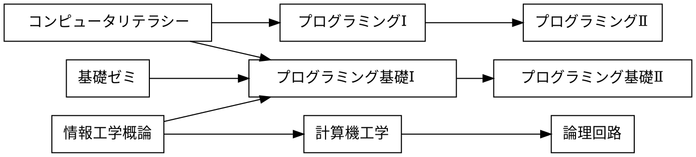

# 課題

## 課題 3.1 有向グラフ


プレビュー結果が上の図のようになるように，下記の記述を完成させよ．(接続関係が正しければ，上下が入れ替わっても構わない)

※ 日本語の文字列に対する箱の大きさが適切でない場合には，前後に空白を入れて調整せよ



## 課題 3.2 WBS


プレビュー結果が上の図のようになるように，下記の記述を完成させよ．(色や影などの違いは気にしなくてよい)

```plantUML
@startwbs ex02
* 拓殖大学
** 商学部
*** 経営学科
*** 国際ビジネス学科
*** 会計学科
** 政経学部
*** 法律政治学科
*** 経済学科
*** 社会安全学科
** 外国語学部
*** 英米語学科
*** 中国語学科
*** スペイン語学科
*** 国際日本語学科
** 工学部
*** 機械システム学科
*** 電子システム学科
*** 情報工学科
*** デザイン学科
** 国際学部
*** 国際学科
@endwbs
```

## 課題 3.3 ユースケース図


プレビュー結果が上の図のようになるように，下記の記述を完成させよ．ただし，別名については適当に設定してよい．(色や影などの違いは気にしなくてよい)

```plantUML
@startuml ex03
left to right direction
actor 学生 as student
actor 教員 as faculty
rectangle {
    usecase "課題の登録" as uc1
    usecase "課題の受領" as uc2
    usecase "レポジトリのクローン" as uc3
    usecase "課題ファイルの修正" as uc4
    usecase "修正をステージに上げる" as uc5
    usecase "修正のコミット" as uc6
    usecase "リモートリポジトリにpush" as uc7
    usecase "提出結果の採点" as uc8
}
uc1 <-- faculty
student --> uc2
student --> uc3
student --> uc4
student --> uc5
student --> uc6
student --> uc7
uc8 <-- faculty
@enduml
```

## 課題 3.4 オリジナルの図解

「有向グラフ」「WBS」「ユースケース図」のどれかを使って，
独自の図解を作成せよ．対象は自由に決めてよいが，
誰かのコピーにならないように留意せよ．

```plantUML
@startwbs
* 東京都
** 特別区
*** 千代田区
*** 中央区
*** 港区
*** 新宿区
*** 文京区
*** 台東区
*** 墨田区
*** 江東区
*** 品川区
*** 目黒区
*** 大田区
*** 世田谷区
*** 渋谷区
*** 中野区
*** 杉並区
*** 豊島区
*** 北区
*** 荒川区
*** 板橋区
*** 練馬区
*** 足立区
*** 葛飾区
*** 江戸川区
** 多摩地域
*** 八王子市
*** 立川市
*** 武蔵野市
*** 三鷹市
*** 青梅市
*** 府中市
*** 昭島市
*** 調布市
*** 町田市
*** 小金井市
*** 小平市
*** 日野市
*** 東村山市
*** 国分寺市
*** 国立市
*** 福生市
*** 狛江市
*** 東大和市
*** 清瀬市
*** 東久留米市
*** 武蔵村山
*** 多摩市
*** 稲城市
*** 羽村市
*** あきる野市
*** 西東京市
*** 瑞穂町
*** 日の出町
*** 檜原村
*** 奥多摩町
** 伊豆・小笠原諸島
*** 大島町
*** 利島村
*** 新島村
*** 神津島村
*** 三宅村
*** 御蔵島村
*** 八丈町
*** 青ヶ島村
*** 小笠原村
@endwbs
```


## チェック
- [x] 課題 3.1 有向グラフ
- [x] 課題 3.2 WBS
- [x] 課題 3.3 ユースケース図
- [x] 課題 3.4 オリジナルの図解
